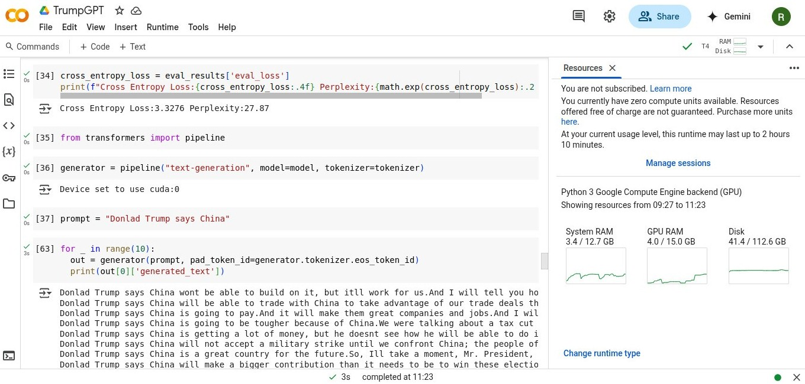

# TrumpGPT
A GPT model trained to mimic Donald Trump's speaking style - just for fun.

This project implements Causal Language Modeling (CLM) and is trained on a collection of Donald Trump's speeches to generate text in a similar tone and manner. Fine-tuning is performed using LoRA (Low-Rank Adaptation) for efficient training on limited resources.


<h3 align="center">Run on Google Colab (No GPU Required)</h3>
<p align="center">
    
    <br />
    <sup>You can run this notebook directly on Google Colab, even if you don't have a GPU!</sup>
</p>


## Todo
- [ ] Experiment with other base models speically smaller models
- [ ] Train on a larger dataset
- [ ] Deploy a simple web demo for interactive text generation
- [ ] Fine-tune model hyperparameters (e.g., learning rate, batch size, context length) for LoRA


## Dependencies
1. [datasets](https://github.com/huggingface/datasets): Tested on version 3.5.0
2. [transformers](https://github.com/huggingface/transformers): Tested on version 4.51.3
3. [peft](https://github.com/huggingface/peft): Tested on version 0.14.0


## Generated Text
```
Donlad Trump says China isnt a friend.We have a great job that people dont like, but we have tremendous businesses going through this area.But they didnt like it, and theyre going to get it a little bit lower than whats happening
Donlad Trump says China could be a bigger problem.But I will say: I will try to go ahead and say, How will he even do it if?We had these guys all living in an area and you all know that youllnt
Donlad Trump says China has its problems, but China will fix them because thats not right.And were going to have all of these issues solved, and I will not compromise on them.On Tuesday, President Xi will meet with other countries for a
Donlad Trump says China will help build the Americas.And he will not just say those are the problems in China.MR. SPICER: Yeah.They wont, I will.Theres no longer the problem as to who will become the
Donlad Trump says China will never have to deal with ISIS, and we have not even known or saw them before.And he thinks so, and he knows what she hes going to tell him about it.MR. SPICER: Sorry,
Donlad Trump says China will no longer pay for our exports but its done.And I mean, whats going on this, were you going to get that on the table?And Im also going to get you going to see more cases in Michigan.
Donlad Trump says China will destroy Israel, including on nuclear arms.I will tell you, the President is going to be listening to you very closely.And we will never stop fighting alongside and against terrorists.Its hard to even get them to do
Donlad Trump says China will be our partner.In a sense, it would mean good things for the American people, our companies and our businesses, but were going to have to go to Cuba, and I think thats the point.And the other
Donlad Trump says China will be very worried.But with the President going down, and he wants to go back on his rhetoric.And I know that a lot of their money is going to be going toward the hospital.With the help of the
Donlad Trump says China will come back for trade deals with us.And the Democrats will be happy, too.MR. SPICER: Theyre going to tell you, but I promise you you, I think the Democrats will actually get this
```


## References
1. [Causal Language Modeling](https://huggingface.co/docs/transformers/en/tasks/language_modeling)
2. [jonaskoenig/trump_administration_statement](https://huggingface.co/datasets/jonaskoenig/trump_administration_statement) dataset
